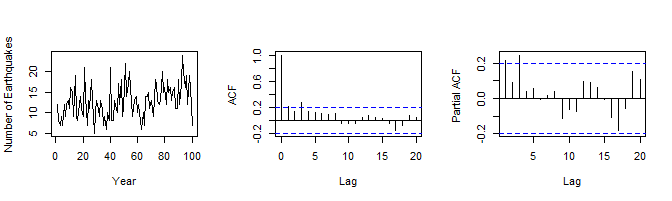
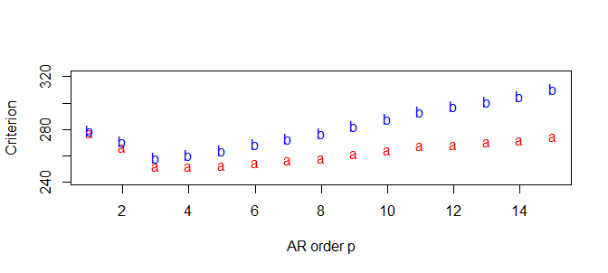

Time Series Analysis of Earthquake Data
================
2023-05-02

### Abstract

In this project, we develop and compare time series models for the
annual number of earthquakes of magnitude greater than 7 on the Richter
scale for 100 years, from 1918 to 2020. The first 100 observations will
be used as the training set and the last 3 observations will be used to
assess the predictive accuracy of the fitted models. Using the results
of our models, we address the following questions: is the time series
weakly or strongly stationary; does the time series have a trend or
periodic pattern; under the assumption of an autoregressive (AR) model
or a finite mixture of AR models, what are the 3-step ahead predictions
of the time series?

### Introduction

Earthquake prediction is presently an inexact science. Even with an
extensive understanding of how earthquakes occur, it is difficult to
translate early warning signs into a prediction of the time, location
and magnitude of an impending earthquake. Scientists have developed
sophisticated mathematical models of tectonic plate movements and more
recently have tried applying machine learning techniques to these models
to make predictions, but with a lack of extensive data on early warning
signs, the predictive capabilities of the models remain fairly weak. The
United States Geological Survey (USGS) FAQ page continues to assert that
“neither the USGS nor any other scientists have ever predicted a major
earthquake”, and that “\[they\] do not know how, and \[they\] do not
expect to know how any time in the foreseeable future”. In this project,
we approach the problem of earthquake prediction from a purely data
analytic point of view. Our main goal is not to predict individual
occurrences of earthquakes, but rather try to model the annual number of
major earthquakes (earthquakes of magnitude greater than 7 on the
Richter scale). Using data of the annual number of earthquakes of
magnitude greater than 7 on the Richter scale for 100 years, from 1918
to 2020, we build and compare two time series models to fit the data:
first, a single AR model; second, a mixture autoregressive (MAR) model.

### Data

We first plot the training set, which consists of 100 observations. Each
observation is the annual number of earthquakes of magnitude greater
than 7 on the Richter scale. The mean of the data is 12.77 and the
variance is 16.62333. We observe a quasi-periodic pattern in the data
but no discernible trend. Furthermore, there is some evidence of
non-stationarity of the time series in the autocorrelation and
partial-autocorrelation function plots. The plots of the autocorrelation
and partial-autocorrelation functions do not display any particular
pattern and do not appear to decrease to zero with increasing lags,
supporting the view that the time series is not weakly stationary.

<!-- -->

### AR Model

We begin by fitting an AR model to the data. In order to determine the
best order $p$ for the AR model, we estimate the Akaike Information
Criterion (AIC) and Bayes information criterion (BIC) for values of $p$
ranging from $1$ to $15$, and pick a value of $p$ which gives small AIC
and BIC values.

<!-- -->

The smallest AIC value is 251.4111, attained at $p=4$, while the
smallest BIC value is 259.1044, attained at $p=3$. Since the AIC value
of 251.7765 at $p=3$ is rather close to the minimum AIC value, we choose
$p=3$ as the order of our AR model. The full hierarchical specification
of the AR(3) model is as follows:

$$y \sim N(F^T {\phi},\nu {I}_n),$$

$$~{\phi} \sim N({m}_0,\nu {C}_0),$$

$$~\nu \sim IG\left(\frac{n_0}{2},\frac{d_0}{2}\right).$$

Here the response vector ${y}$ is

$$\begin{bmatrix} y_4 & y_5 & \cdots & y_{100}\end{bmatrix}^T,$$

$n = 97$, ${y} \in \mathbb{R}^n$,

$$F=\begin{bmatrix}  o_3 & \cdots & o_{99} \\ 
o_2 & \cdots & o_{98} \\ 
o_1 & \cdots & o_{97} \end{bmatrix},$$

where the 100 observations are $o_1,\ldots,o_{100}$. Furthermore, we
choose the hyperparameters

$${m}_0 = \begin{bmatrix} 0 & 0 & 0 \end{bmatrix}^T,$$

$$C_0 = 10I_3$$

and

$$n_0 = d_0 = 0.02.$$

To see that the posterior distributions of ${\phi}$ and $\nu$ are quite
robust to small changes in the hyperparameters, we calculate the
posterior mean estimate of $\phi$ for 3 different sets of
hyperparameters: (1)

$${m}_0 = \begin{bmatrix} 0 & 0 & 0 \end{bmatrix}^T,$$ $C_0 = 10I_3$ and
$n_0 = d_0 = 0.02$; (2)

$${m}_0 = \begin{bmatrix} 0 & 0 & 0 \end{bmatrix}^T,$$

$C_0 = 5I_3$ and $n_0 = 0.1$, $d_0 = 0.2$; (3)

$${m}_0 = \begin{bmatrix} 1 & 1 & 1 \end{bmatrix}^T,$$ $C_0 = 2I_3$ and
$n_0 = 0.1$, $d_0 = 0.2$.

The posterior mean estimates of

$${\phi} = \begin{bmatrix} \phi_1 & \phi_2 & \phi_3\end{bmatrix}^T$$ and
$\nu$ for the 3 parameter sets are: (1)

$${\phi} = \begin{bmatrix} 0.3332798 &  0.2059251 & 0.4428161\end{bmatrix}^T,$$  
$\nu = 17.14287$; (2)
$${\phi} = \begin{bmatrix} 0.3332784 & 0.2059347 & 0.4428060\end{bmatrix}^T,$$
$\nu = 17.14536$; (3)
$${\phi} = \begin{bmatrix} 0.3332819 & 0.2059726 & 0.4427885\end{bmatrix}^T,$$
$\nu = 17.15202$. Hence the posterior distributions of ${\phi}$ and
$\nu$ are quite robust with respect to the choice of hyperparameters.

Next, we draw 5000 samples of $(\phi_1,\phi_2,\phi_3,\nu)$ from their
marginal posterior distributions and plot them. As discussed earlier, we
will use the hyperparameters

$${m}_0 = \begin{bmatrix} 0 & 0 & 0 \end{bmatrix}^T,$$ $C_0 = 10I_3$ and
$n_0 = d_0 = 0.02$. For each sample $({\phi},\nu)$ drawn, we compute
${\mu} = F^T{\phi}$ as an estimate for the mean of ${y}$, and for each
$i \in \{4,\ldots,100\}$, we draw a sample of $y_i$ from the
distribution $N({\mu}[i-3], \nu)$. For each $i$, we take the mean of all
$y_i$’s so obtained over the 5000 samples. The 95% credible interval for
each point $y_i$ is also computed.

Using the 5000 samples of $({\phi},\nu)$ obtained earlier, we compute
3-step ahead predictions for $y_{101}, y_{102}$ and $y_{103}$ and
compare them to the actual observations in the test data. The first
three plots are the histograms of the predictions. The fourth plot shows
the three test observations $y_{101},y_{102}$ and $y_{103}$ (in black)
and the mean predictions (in green) for these three points as well as
the corresponding 95% credible intervals. The mean predictions and
corresponding 95% credible intervals for $y_{101} = 17,y_{102} = 10$ and
$y_{103} = 9$ are also listed below.

### Mixture of AR Models

A mixture of AR models might be an appropriate fit to the data if the
time series can be segmented into homogeneous parts. In order to
determine an appropriate number of AR components, we compute the
Deviance Information Criterion (DIC) for a mixture of $K$ AR models with
$K \in \{2,3,4,5\}$ components, and choose the value of $K$ that gives
the smallest DIC value. Each AR component is of order $3$, as chosen
earlier. The prior hyperparameters for each component also remain
unchanged from our earlier pick:

$${m}_0 = \begin{bmatrix} 0 & 0 & 0 \end{bmatrix}^T,$$ $C_0 = 10I_3$ and
$n_0 = d_0 = 0.02$. As with the case of the single AR model, we observe
that the posterior distributions of the parameters are relatively
insensitive to small changes in the prior hyperparameters. The DIC value
for each $K$ is computed by first performing 20000 iterations of Gibbs
sampling to estimate the parameters ${\omega}_k$, ${\beta}_k$, $\nu_k$
and $L_t$ (to be defined later) for $k \in \{1,\ldots,K\}$. The DIC
values obtained for $K=2,3,4$ and $5$ are, respectively, 558.9859,
561.6269, 535.4260 and 563.0833. Since $K=4$ gives the smallest DIC
value, we choose a mixture of $4$ AR models, where each AR model is of
order $p=3$ and has prior hyperparameters as specified earlier. The full
hierarchical specification of the mixture model is:

$$y_t \sim \sum_{k=1}^4 \omega_kN({f}^T_t{\beta}_k,\nu_k),$$

$${f}^T_t = \begin{bmatrix} y_{t-1} & y_{t-2} & y_{t-3} \end{bmatrix},$$
$$t \in \{4,\ldots,100\},$$ $$\omega_k \sim Dir(a_1,\ldots,a_k),$$
$${\beta}_k \sim N({m}_0,\nu_k{C}_0),$$
$$\nu_k \sim IG(\frac{n_0}{2}, \frac{d_0}{2}).$$ In addition to the
hyperparameters specified earlier, we set $a_i = 1$ for each
$i \in \{1,2,3,4\}$. We also let $L_t$ be the latent variable defined by
$L_t = k$ iff $$y_t \sim N({f}^T_t{\beta}_k,\nu_k).$$ A posterior
analysis is carried out using 10000 iterations of Gibbs sampling with a
burn-in period of 5000 iterations. We then perform 3-step ahead
predictions for $y_{101},y_{102}$ and $y_{103}$ based on estimates for
$\omega_k$, $L_t$, $\nu_k$ and ${\beta}_k$ (where $k \in \{1,2,3,4\}$)
obtained by the Gibbs sampling iterations. The results are given below.

### Model Comparison

We determined earlier that a mixture of $4$ AR models with prior
hyperparameters

$${m}_0 = \begin{bmatrix} 0 & 0 & 0 \end{bmatrix}^T,$$ $C_0 = 10I_3$,
$n_0 = d_0 = 0.02$ and $a_1 = a_2 = a_3 = a_4 = 1$ has DIC value
535.4260. In order to compare the performance of the single AR model
with the mixture AR model, we compute the DIC value for a single AR
model of order 3, choosing the same prior hyperparameters used for each
component in the mixture model. This is done by drawing 5000 posterior
samples of $({\phi},\nu)$ and using these samples to estimate the log
likelihood function of $(y_4,y_5,\ldots,y_{100})$. The DIC value
obtained is 556.9009, which suggests that a mixture of 4 AR models fits
the data better than a single AR model. Moreover, one may note that the
3-step ahead predictions of $y_{101},y_{102}$ and $y_{103}$ for the
mixture of 4 AR models are somewhat more accurate than those of the
single AR model: the mean-squared error for the mixture of 4 AR models
is 6.424844, whereas that for the single AR model is 6.681463.

### Conclusions

Based on the computed DIC values, it would seem that a mixture of 4 AR
models, each of order 3, would be preferred over a single AR model of
order 3. Indeed, a mixture model might make sense in the context of the
data since the frequency-magnitude distribution of earthquakes possibly
varies across different regions of the world. In addition, as was
mentioned in the Data section, some graphical features of the time
series seem to imply non-(weak)stationarity, so that a single AR model
might not be appropriate. For example, if all 103 observations are split
into 3 segments, one segment containing the first 34 observations,
another containing the next 34 observations, and the third containing
the last 35 observations, the mean values of the 3 segments are,
respectively, 11.5, 12.08824 and 14.6. One may also test for
stationarity using the augmented Dicker-Fuller test. This test can be
carried out using the adf.test() function of the tseries library in R.

    ## Mean of first 34 observations:  11.5

    ## Mean of next 34 observations:  12.08824

    ## Mean of last 35 observations:  14.6

    ## 
    ##  Augmented Dickey-Fuller Test
    ## 
    ## data:  y
    ## Dickey-Fuller = -3.4452, Lag order = 4, p-value = 0.05076
    ## alternative hypothesis: stationary

The p-value obtained from the test is 0.05076, which is greater than
0.05, so at the 95% confidence level the null hypothesis not rejected,
implying that the time series is not weakly stationary. One limitation
of the model is that the variance $\nu_k$ of each $y_t$ is assumed to
have the same distribution. One might ask whether creating another level
in the hierarchical model, where the scale and rate parameters
themselves follow particular distributions, would result in a model that
better fits the data. Another weakness of the mixture model seems to be
the greater uncertainty in the 3-step ahead predictions of $y_{101}$,
$y_{102}$ and $y_{103}$, particularly for $y_{103}$, compared to the
predictions in the single AR model, as indicated by the much larger 95%
credible intervals corresponding to these predictions in the mixture
model. Furthermore, it is possible that the mixture of 4 AR models is
overfitting the data. The predictive capabilities of the models might be
more accurately assessed on a larger test dataset, say at least half the
size of the training data.
